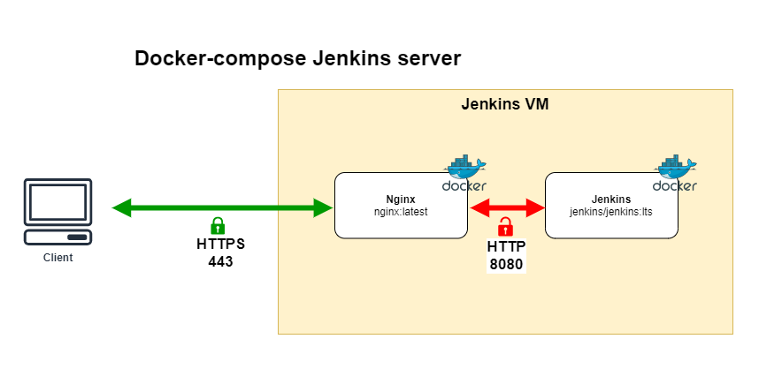

# Jenkins Master Bootstrap

Bootstrap Jenkins server into a container.

## Prequisites
* Docker
* Docker-compose

## Nginx config
Nginx is stored under ***nginx/conf.d*** and need to be updated according to your server DNS name.

## Set-up the ssl certificate
You will need to create/past the following certificate under the ***nginx/certs*** folder to enable HTTPS properly:
* jenkins.crt
* jenkins.key

## Achitecture


## How to run the container
```bash
docker-compose up -d
```

## Clean the environment and re-pull the lastest TLS versions
```bash
docker-compose down --remove-orphans --rmi all
docker-compose up --force-recreate -d
```

## TO_DO:
* Set-up ECS deployment
